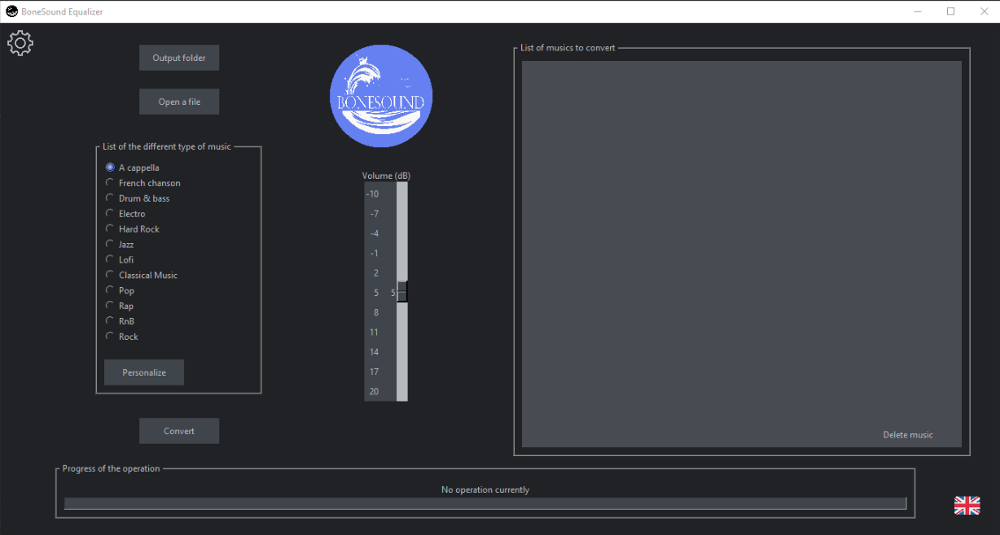

# Égaliseur BoneSound / BoneSound Equalizer

Un égaliseur pour le casque BoneSound.\
An equalizer for the BoneSound headset.

### Prérequis / Prerequisites

Vous devez avoir installé ffmpeg et l'avoir mis dans le même dossier que le projet.\
You will need ffmpeg to be installed and in the same folder as the project.\
\
Vous pouvez le télécharger depuis [ce lien](https://ffmpeg.org/).\
You can download it from [here](https://ffmpeg.org/).

### Structure de fichier / Folder Structure

**image/** : La localisation des images utilisées par le programme.\
**image/** : Location of images used in the program.\
\
_Si vous voulez changer une image, nommez-la avec le nom de celle que vous voulez remplacer._\
_If you want to change an image, name it with the name of the one you want to change._

### Aperçu de l'application / App Preview



### Installation / Installing

Les librairies easygui, pydub, numpy et Pillow doivent être installées.\
You will need easygui, pydub, numpy and Pillow libraries to be installed.\
\
Pour ce faire, entrer la commande suivante dans la console windows:\
To do so, just run on cmd:

```
pip install -r requirements.txt
```

## Lancer les tests / Running the tests

Lancez juste BoneSound_Equailzer.py et testez toutes les commandes.\
Just run BoneSound_Equailzer.py and test all commands.


## Raccourcis clavier / Keyboard Shortcuts

_Français / French_

**Fenêtre principale :**
- Suppr : Supprime la musique séléctionnée de la liste
- Entrée : Lance la conversion de la musique
- p : Ouvre la fenêtre des paramètres
- Ctrl + s : Ouvere la fenêtre de séléction du dossier de sortie
- Ctrl + o : Ouvre la fenêtre de séléction de la musique
- Ctrl + p : Ouvre la fenêtre de personnalisation
- Shift : Change la langue de l'application

**Fenêtre des paramètres :**
- Suppr : Ferme la fenêtre
- c : Ouvre la fenêtre de séléction de la couleur
- Shift : Change la langue de l'application

**Fenêtre de personnalisation :**
- Suppr : Ferme la fenêtre

_Anglais / English_

**Main Window :**
- Suppr : Delete the selected song of the list
- Enter : Start the music conversion
- p : Open the settings window
- Ctrl + s : Open the output folder selection window
- Ctrl + o : Open the music selection window
- Ctrl + p : Open the personalize window
- Shift : Swicth the language of the app

**Settings window :**
- Suppr : Close the window
- c : Open the color selelction window
- Shift : Swicth the language of the app

**Personalize window :**
- Suppr : Close the window


## Déploiement / Deployment

Vous pouvez construire le projet en exécutable en installant auto-py-to-exe avec la commande suivante.\
You can build this as an .exe by installing auto-py-to-exe with the following command.

```
pip install auto-py-to-exe
```

Puis en lançant la commande suivante.\
Then by running the command.

```
auto-py-to-exe
```

_N'oubliez pas d'ajouter ffmpeg.exe, votre icône et le dossier image pour le faire fonctionner la conversion._\
_Don't forget to add ffmpeg.exe, your icon and the image folder to make the conversion work._

## Construit avec l'outil suivant /  Built with the following tool

- Le convertisseur de son : [FFMPEG](https://ffmpeg.org/)
- The Sound converter : [FFMPEG](https://ffmpeg.org/)

## Auteur / Author

- [**Maxime Roucher**](https://github.com/maximeroucher)
